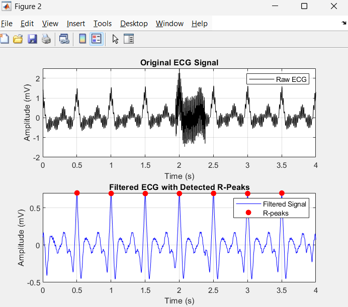
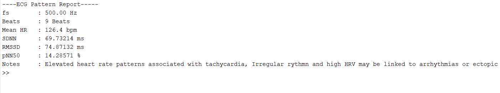
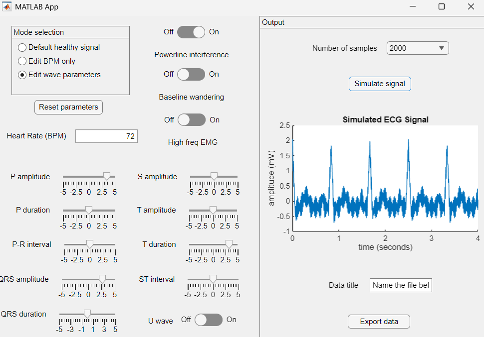

# The Puzzling Electrocardiogram

MATLAB project for analysing simulated ECG signals, completed as part of the University of Bath Project Week "The Puzzling Echocardiogram".

This script loads ECG data, applies noise reduction filters, detects R-peaks, and calculates key heart rate variability (HRV) metrics.


## Overview

**Main file:** `ecg_analysis.m`  
**Input:** `.mat` file containing `Time` and `Signal` arrays  
**Output:**  
- Filtered ECG plot with detected R-peaks  
- HRV summary report in the MATLAB console  
- Example figures stored in `/images`


## How to Run

1. Open MATLAB.  
2. Clone or download this repository.  
3. Place your `.mat` file in a folder called `tests/` (for example, `tests/noisySignal.mat`).  
4. Run the analysis script:

```matlab
clear; clc;
ecg_analysis
```


## Processing Steps

| Step | Description |
|------|--------------|
| 1 | Load ECG data (`Time`, `Signal`) |
| 2 | Remove DC offset and baseline wander |
| 3 | Apply notch and bandpass filters (5–40 Hz) |
| 4 | Detect R-peaks using adaptive prominence |
| 5 | Compute heart rate and HRV metrics (SDNN, RMSSD, pNN50) |
| 6 | Display a textual ECG pattern report and plots |

Example output:

```
----ECG Pattern Report-----
fs        : 500.00 Hz
Beats     : 7 Beats
Mean HR   : 120.0 bpm
SDNN      : 23.4 ms
RMSSD     : 31.2 ms
pNN50     : 15.0 %
Notes     : Elevated heart rate patterns associated with tachycardia
```


## Images

### Filtered ECG with Detected R-Peaks


### Example ECG Report Output


### MATLAB Signal Generator GUI



## Notes

- Works best with signals longer 5 it probably wont work well if it's shorter.  
- If no peaks are detected, lower the `MinPeakProminence` value or use a cleaner ECG sample.  
- Designed for learning ECG signal processing and demonstrating QMS documentation in Project Week.


## Credits

All MATLAB programming by **Alvaro Balbin**.  
GenAI assisted with documentation (README formatting and explanations).
